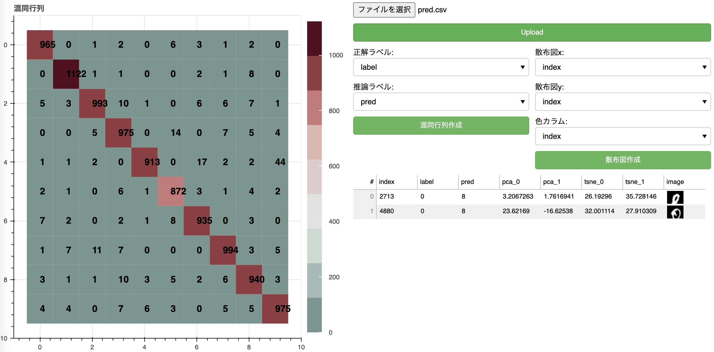
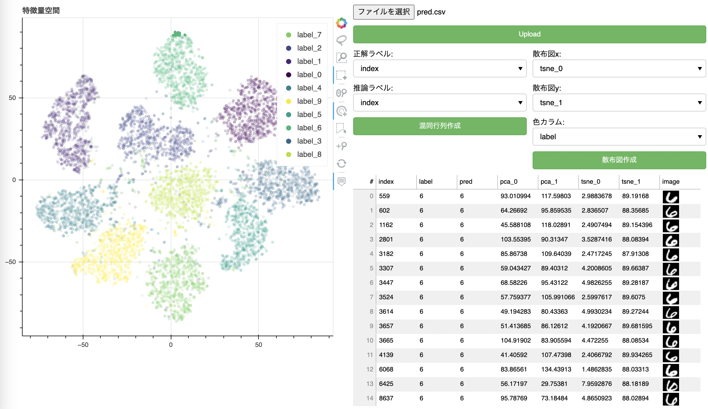

# mnist-viewer

mnistの分類結果を混同行列と特徴量の散布図で確認できるツール.
分類結果を保存したcsvファイルを読み込んで、混同行列と散布図を描画,各サンプルの画像を確認できる.

# デモ

混同行列


散布図


# 機能

mnistの分類結果を記録したcsvをアップロードすることで,下記で各画像を確認できる。

* 正解ラベルと推論ラベルのカラム名を指定することで混同行列を描く
  * 混同行列の各マスのサンプル画像を確認できる

* 次元圧縮したxとyのラベル及び色分けに使うカラム名を指定する事で散布図を描く
  * 散布図上のサンプルを選択することで各画像を確認できる

# 必要とする環境

下記環境で開発
* Python 3.9.1
* scikit-learn==0.24.2
* torch==1.8.0
* torchvision==0.2.2
* pandas==1.2.4
* flask==2.0.1
* flask_login==0.5.0
* flask_sqlalchemy==2.5.1
* flask_bootstrap==3.3.7.1
* bokeh==2.3.2

# インストール

下記コマンドで必要なライブラリをインストールする.

```bash
pip install requirements.txt
```

# 使い方

* 起動方法
```bash
git clone https://github.com/notfolder/mnist-viewer.git
cd mnist-viewer
python app.py
```

* 上記で起動後、ブラウザでport 8080を開く.
http://localhost:8080/

* 最初に「ファイル選択」でアップロードするcsvを選び、「Upload」ボタンを押す.
  * csvファイルにはmnistのtest画像の番号が'index'というフィールドに保存されていること.

* 「正解ラベル」「推論ラベル」を選択し,「混同行列生成」ボタンで混同行列を表示後,各セルをクリックする事で各サンプルの画像を確認できる
* 「散布図x」「散布図y」「色カラム」を選択し,「散布図作成」ぼたんで散布図を表示後、各サンプルを選択する事で、画像を確認できる


# 作者

mail to: notfolder@gmail.com

# ライセンス
ライセンスを明示する

"mnist-viwer" is under [MIT license](https://en.wikipedia.org/wiki/MIT_License).
